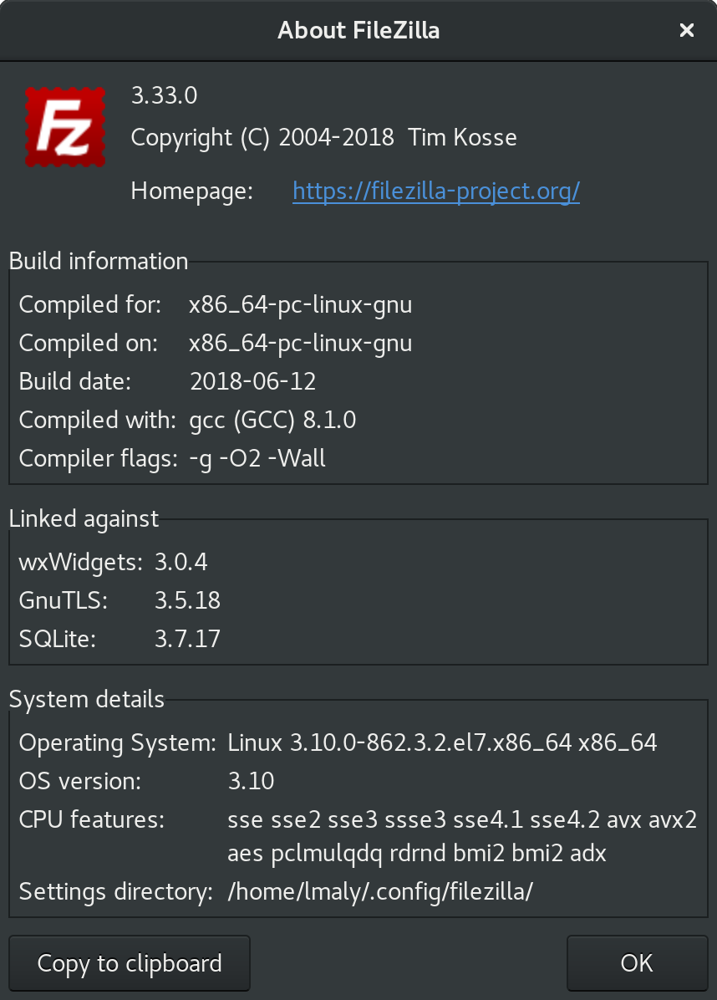

# FileZilla-for-CentOS7

## How to build FileZilla `v3.33.0` on CentOS `v7.5` from the source

### Download all the dependencies first:

```bash
cd ~/Downloads/
wget https://dl1.cdn.filezilla-project.org/client/FileZilla_3.33.0_src.tar.bz2
wget https://dl1.cdn.filezilla-project.org/libfilezilla/libfilezilla-0.12.3.tar.bz2
wget https://github.com/wxWidgets/wxWidgets/releases/download/v3.0.4/wxWidgets-3.0.4.tar.bz2
wget https://ftp.gnu.org/gnu/nettle/nettle-3.4.tar.gz
wget https://www.gnupg.org/ftp/gcrypt/gnutls/v3.5/gnutls-3.5.18.tar.xz
```

### Prepare system for the development:

```bash
sudo yum install centos-release-scl devtoolset-7-gcc* gtk3-devel libtasn1-devel libidn-devel p11-kit-devel pugixml-devel cppunit-devel sqlite-devel -y
scl enable devtoolset-7 bash
gcc --version
g++ --version
```

### Extract all the tarballs:

```bash
tar xvzf nettle-3.4.tar.gz
tar xjvf libfilezilla-0.12.3.tar.bz2
tar xjvf FileZilla_3.33.0_src.tar.bz2
tar xjvf wxWidgets-3.0.4.tar.bz2
tar xvf gnutls-3.5.18.tar.xz
```

### Let's build libfilezilla:

```bash
cd libfilezilla-0.12.3/
mkdir compile
cd compile/
../configure
make
sudo make install
sudo ldconfig
cd ~/Downloads/
```

### Build wxWidgets:

```bash
cd wxWidgets-3.0.4/
./configure
make
sudo make install
sudo cp ~/Downloads/wxWidgets-3.0.4/lib/libwx_baseu_xml-3.0.so.0 /usr/lib64
sudo ldconfig
wx-config --version
wxrc -h
cd ~/Downloads/
```

### Build Nettle:

```bash
cd nettle-3.4/
./configure --enable-shared --prefix=/usr
make
sudo make install
cd ~/Downloads/
```

### Build GnuTLS:

```bash
cd gnutls-3.5.18/
./configure --with-libnettle-prefix=/usr --with-included-unistring
make
sudo make install
cd ~/Downloads/
```

### And finally build Filezilla:

```bash
cd filezilla-3.33.0/
mkdir compile
cd compile/
LD_LIBRARY_PATH=/usr/local/lib64:/usr/local/lib PKG_CONFIG_PATH=/usr/local/lib/pkgconfig ../configure
make
sudo make install
filezilla
```

### Screenshot:



Note: :point_up: has been compiled in a same way, but on GCC v8.1.0
